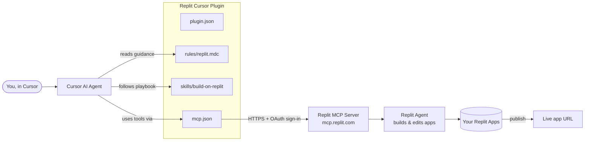

# Architecture

## The pieces

- **You, in Cursor** — you type what you want in Cursor's agent chat.
- **Cursor AI Agent** — Cursor's built-in assistant. It decides when to use Replit.
- **plugin.json** — the plugin's ID card (name, version, description). Cursor uses it to recognize the plugin.
- **rules/replit.mdc** — standing instructions telling the agent when and how to use Replit.
- **skills/build-on-replit** — a step-by-step playbook for build → change → publish.
- **mcp.json** — tells Cursor where Replit's server lives. No keys stored here.
- **Replit MCP Server** — Replit's online service that accepts requests from AI tools. You sign in once through your browser.
- **Replit Agent** — Replit's own AI that actually writes and changes the app code.
- **Your Replit Apps** — the apps in your Replit account.
- **Live app URL** — the public link you get after publishing.
